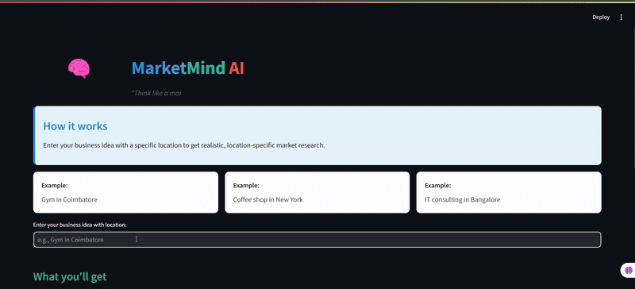

# Local Market Research Assistant



## Project Overview
The Local Market Research Assistant is a powerful AI-driven tool that provides location-specific market research for business ideas. It leverages Groq's advanced language models combined with real web data from SerpAPI to deliver comprehensive, actionable market intelligence that would traditionally require hours of manual research.

## Key Features
- **Real Location-Specific Data**: Analyzes actual local businesses in your target area
- **Competitor Intelligence**: Identifies and analyzes competitors' strengths and weaknesses
- **Market Trend Analysis**: Tracks current market trends relevant to your business idea
- **Demographic Insights**: Provides demographic data about your target location
- **Strategic Recommendations**: Offers actionable business recommendations based on the analysis
- **Beautiful Reports**: Generates well-formatted, downloadable reports ready for presentation

## How It Works
The application uses a combination of AI agents and real-time web data to generate comprehensive market analysis:

1. **Local Search Agent**: Finds and analyzes location-specific businesses matching your criteria
2. **Competitor Analysis Agent**: Identifies strengths, weaknesses, and gaps in the competitive landscape
3. **Trend Analysis Agent**: Identifies current market trends using Google Trends and news data
4. **Market Analysis Agent**: Synthesizes all findings into a comprehensive market assessment
5. **Report Generator**: Creates a polished report with executive summary and recommendations

## Technologies Used
- **Framework**: Streamlit for the web interface
- **AI Processing**: Groq LLM (Llama3-70b-8192) via LangChain
- **Data Sources**:
  - SerpAPI for Google Maps and web searches
  - Google Trends for trend analysis
  - Web scraping for content analysis
- **Data Processing**: Beautiful Soup, Pandas
- **Output Formatting**: Markdown, HTML

## Installation & Setup

### Prerequisites
- Python 3.8 or higher
- Groq API key
- SerpAPI API key

### Installation Steps
1. Clone the repository:
   ```
   git clone https://github.com/yourusername/local-market-research-assistant.git
   cd local-market-research-assistant
   ```

2. Install dependencies:
   ```
   pip install -r requirements.txt
   ```

3. Create a `.streamlit/secrets.toml` file with your API keys:
   ```
   GROQ_API_KEY = "your-groq-api-key"
   SERPAPI_API_KEY = "your-serpapi-api-key"
   ```

4. Run the application:
   ```
   streamlit run main.py
   ```

## Usage Guide

### Basic Usage
1. Enter your business idea with a specific location (e.g., "Coffee shop in Portland")
2. Click "Generate Market Research Report"
3. Wait while the system collects and analyzes data (typically 2-5 minutes)
4. View the generated report or download it in Markdown or HTML format

### Best Practices for Optimal Results
- **Be Specific**: Include a clear business type and location
- **Provide Context**: More specific business ideas yield better results
- **Allow Sufficient Time**: Comprehensive analysis requires time to gather data
- **Review Raw Data**: Check the Raw Data tab for more detailed findings

## System Architecture
The application uses a modular architecture with these main components:

1. **UI Layer**: Streamlit-based interface with custom CSS styling
2. **Agent Layer**: Specialized AI agents for different aspects of market research
3. **Tool Layer**: Functions for data acquisition and processing from various sources
4. **Data Processing Layer**: Structures for processing and organizing findings
5. **Output Layer**: Report generation and formatting capabilities

## Data Sources & Tools
- **SerpAPI Google Maps**: For location-specific business data
- **SerpAPI Google Search**: For general web information on markets and trends
- **Google Trends API**: For tracking interest over time
- **Web Scraping**: For specific website content analysis
- **News Search**: For local news related to business topics
- **Demographic Data**: For population and demographic information

## Project Structure
```
local-market-research-assistant/
├── main.py          # Main application code
├── requirements.txt # Project dependencies
├── README.md        # Project documentation
├── .streamlit/      # Streamlit configuration
│   └── secrets.toml # API keys and secrets
└── assets/          # Static assets if any
```

## Dependencies
- streamlit
- groq
- langchain
- langchain_groq
- pandas
- requests
- beautifulsoup4
- pytrends
- serpapi
- markdown
- pydantic

## API Usage & Costs
- **Groq API**: Used for AI processing (check pricing at groq.com)
- **SerpAPI**: Used for web data collection (check pricing at serpapi.com)

## Output Formats
Reports are available in two formats:
- **Markdown**: Ideal for further editing or incorporating into documentation
- **HTML**: Perfect for sharing or viewing in a browser (can be converted to PDF)

## Limitations
- Analysis depends on publicly available data
- Some business types may have limited local data
- Remote or extremely specific locations may return limited results
- API rate limits may apply based on your subscription plans

## Future Enhancements
- Integration with business plan templates
- Financial projection tools
- Competitive pricing analysis
- Social media sentiment analysis
- Advanced demographic targeting

## Troubleshooting
- **No Results**: Try broader business types or more populous locations
- **Error Messages**: Verify API keys are correct in secrets.toml
- **Slow Performance**: Large markets or complex business types may require more processing time


## Acknowledgments
- Groq for providing the AI language model capabilities
- SerpAPI for real-time web data access
- The LangChain project for agent framework
- Streamlit for the web application framework

---

Created with ❤️ by Akshay Kumar
For questions or support, contact: akshaykumar.smk7@gmail.com